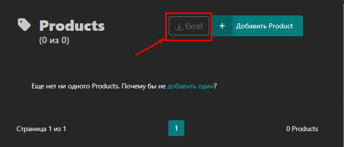
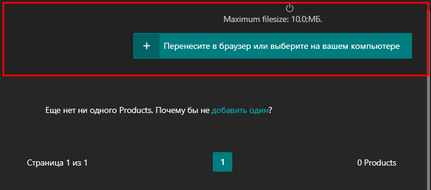

This button hase some status:
- basis status from template. It is from "`download\static\modal_pages\confirm_convert_alias.txt`";
And from 
- "`download\src\load_catalog\functuions.ts::handlerEventsForm`" 4 state of upload of a file.
----

## More EVENTS
The "`download\src\load_catalog\functuions.ts::collectionOfEvents`" provides for more events.

----

## Upload file
User can chooise the Excel (*.xls & *.xlsx) files through a form\
||||
|:---|:---|:---|
||||

---

## How do we regulate the publication of the form?

States of form (it is public or not) we regulate it very simply.\
From the URL path to the "`download\src\functions.ts::publishButtomDownloadCatalog`".\
If we have "`products`" as part of path name it  meens we have a view of button.

## Psevdo env
- "`download\src\dorenv_.ts`"  
  
```code
export const PATHNAME = "/api/download/load/file/"; // API key , It where we send tha data.
export const MAX_CHUNK_SIZE_FILE_BYTES = 81920; // The file share on parts/chunks. 
export const MAX_FILE_SIZE_BYTES = 10485760; // The max size of the file beagin sent
export const LANGUAGE_SUPPORTED_OF_BROWSER = Intl.DateTimeFormat().resolvedOptions().locale; // Languege of browser
```

## Translation

- "`download\static\modal_pages\confirm_convert_alias.txt`"; It is Eng-variant of interface.
- "`download\static\modal_pages\confirm_convert_alias_ru.txt`"; RU
-  "`download\static\modal_pages\confirm_convert_alias_fr.txt`"; FR 
Note: Regulatory is the var "`LANGUAGE_SUPPORTED_OF_BROWSER`" from the "`download\src\dorenv_.ts`".
